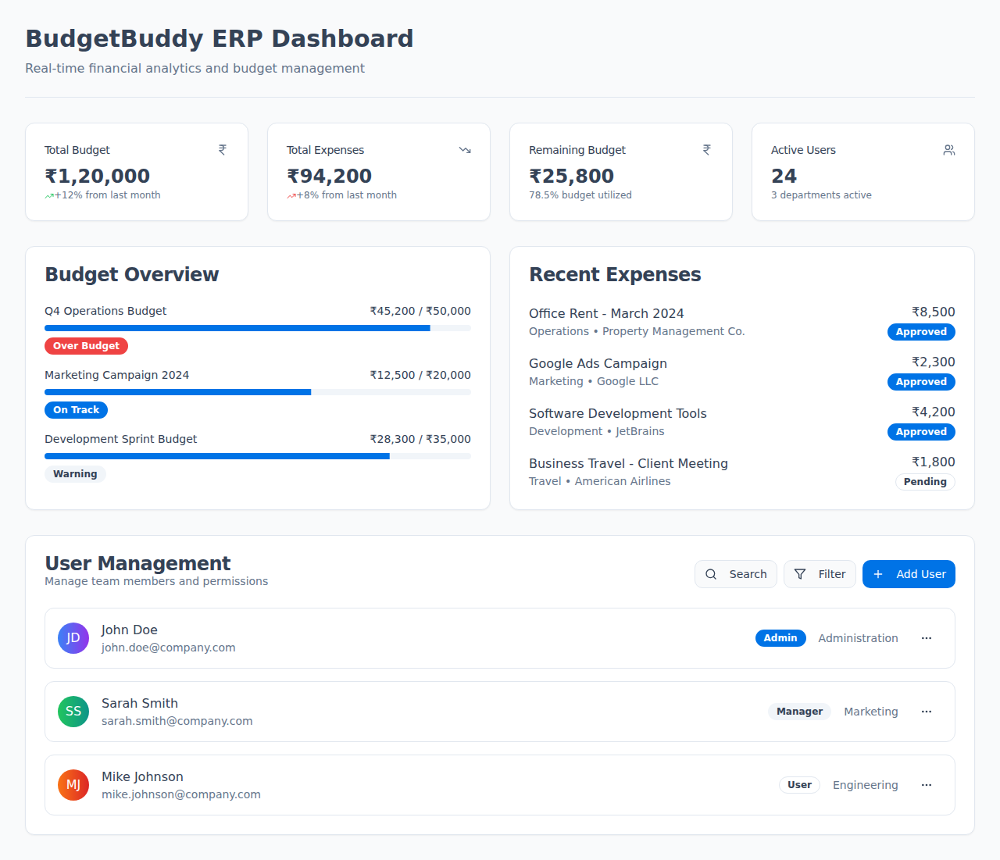

# 📸 Screenshot Guide for BudgetBuddy ERP

This guide will help you capture beautiful screenshots for the README and documentation.

## 🎯 Required Screenshots

### 1. **Dashboard Overview** (`dashboard-screenshot.png`)
- **Page**: Navigate to `/dashboard`
- **Features to highlight**:
  - Summary cards with Indian Rupee formatting (₹)
  - Interactive charts showing budget vs expenses
  - Recent transactions list
  - Budget health indicators
- **Browser**: Use Chrome/Edge with viewport 1920x1080
- **Theme**: Both light and dark mode versions

### 2. **User Management** (`user-management-screenshot.png`)
- **Page**: Navigate to `/users`
- **Features to highlight**:
  - User data table with search functionality
  - Role badges (Admin, Manager, User)
  - Actions dropdown menu
  - User statistics cards
- **Capture**: Show the dropdown menu open with "View Profile", "Edit User", "Manage Permissions" options

### 3. **Budget Management** (`budget-management-screenshot.png`)
- **Page**: Navigate to `/budgets`
- **Features to highlight**:
  - Budget cards with progress bars
  - Indian Rupee formatting (₹1,23,456.78)
  - Budget vs actual spending
  - Category-wise breakdown
- **Actions**: Show a budget card with good visual data

### 4. **Expense Tracking** (`expense-tracking-screenshot.png`)
- **Page**: Navigate to `/expenses`
- **Features to highlight**:
  - Expense data table with filtering
  - Category badges
  - Approval status indicators
  - Add expense modal (open)
- **Capture**: Show the expense form modal open

### 5. **Search Functionality** (`search-functionality-screenshot.png`)
- **Page**: Any page with data table (Users, Expenses, Budgets)
- **Features to highlight**:
  - Search input with active search term
  - Filtered results showing
  - Real-time search results
- **Action**: Type in search box and show filtered results

### 6. **User Profile Dialog** (`user-profile-dialog-screenshot.png`)
- **Page**: Navigate to `/users`
- **Action**: Click "View Profile" from user dropdown
- **Features to highlight**:
  - User avatar and information
  - Activity tracking
  - Permission badges
  - Clean dialog layout

### 7. **Permission Management** (`permission-management-screenshot.png`)
- **Page**: Navigate to `/users`
- **Action**: Click "Manage Permissions" from user dropdown
- **Features to highlight**:
  - Permission categories
  - Checkbox selections
  - Permission descriptions
  - Save/Cancel actions

## 🎨 Screenshot Best Practices

### **Technical Settings**
- **Resolution**: 1920x1080 minimum
- **Browser**: Chrome or Edge (for consistency)
- **Zoom**: 100% (no zoom in/out)
- **Extensions**: Disable ad blockers and other extensions

### **Visual Guidelines**
- **Data**: Use realistic sample data (not "Test User 1", "Test Budget 2")
- **Theme**: Capture both light and dark mode versions
- **UI State**: Show active/hover states where relevant
- **Content**: Ensure text is readable and professional

### **Composition**
- **Focus**: Highlight the main feature being demonstrated
- **Spacing**: Leave some whitespace around the main content
- **Context**: Include navigation/header for context
- **Modals**: Center modals and show backdrop

## 🛠️ Tools for Screenshots

### **Browser Extensions**
- **Awesome Screenshot** - Full page capture
- **Lightshot** - Quick area capture
- **GoFullPage** - Full page scrolling capture

### **Desktop Tools**
- **Snipping Tool** (Windows) - Built-in tool
- **Greenshot** - Free, feature-rich
- **LICEcap** - For animated GIFs

### **Online Tools**
- **CleanShot** - Clean, professional screenshots
- **Screely** - Add device frames
- **Mockuphone** - Mobile device mockups

## 📝 File Naming Convention

```
screenshots/
├── dashboard-overview.png
├── dashboard-overview-dark.png
├── user-management.png
├── user-management-dark.png
├── budget-management.png
├── budget-management-dark.png
├── expense-tracking.png
├── expense-tracking-dark.png
├── search-functionality.png
├── user-profile-dialog.png
├── permission-management.png
└── mobile-responsive.png (bonus)
```

## 🚀 Quick Screenshot Workflow

1. **Setup**: Open application in browser, clear cache, use incognito mode
2. **Data**: Ensure you have good sample data loaded
3. **Theme**: Switch between light/dark themes
4. **Capture**: Take screenshots according to the list above
5. **Edit**: Crop, resize, and optimize images
6. **Save**: Use consistent naming convention
7. **Update**: Replace placeholder images in README

## 🖼️ Image Optimization

### **Before Uploading**
- **Compress**: Use TinyPNG or similar to reduce file size
- **Format**: Use PNG for UI screenshots, JPG for photos
- **Size**: Keep under 500KB per image
- **Dimensions**: Max width 1200px for README display

### **README Integration**
```markdown

*Real-time analytics with Indian Rupee formatting and interactive charts*
```

## 📱 Bonus: Mobile Screenshots

If you want to show mobile responsiveness:
- Use browser developer tools
- Set viewport to iPhone 12 Pro (390x844)
- Capture key pages in mobile view
- Show responsive navigation and layouts

---

**🎉 Once you have the screenshots, replace the placeholder images in the README with your actual screenshots!**